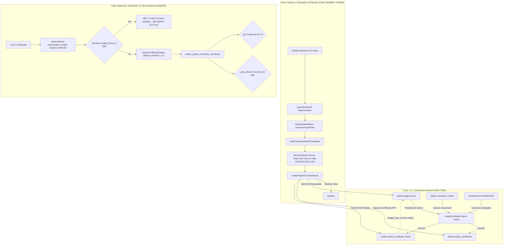

# FORENSIC RECOVERY DEL SISTEMA DE CERTIFICADOS DE AVANCE
**Documento de Investigación Forense y Análisis Arquitectónico**  
**Fecha:** 25 de Septiembre de 2026  
**Repositorio:** `C:\Users\User\Desktop\PORYECTOS\Control de Facturas`  
**Estado:** Read-Only Investigation (Fase Forense) — Cero modificaciones a código fuente.

---

## 1. Executive Finding

### ¿El importador completo existió?
**SÍ.** La capacidad de interpretar e importar planillas complejas de obra (workbooks XLSX) fue desarrollada y probada extensivamente.
Existen dos motores de importación en el repositorio:
1. **El Importador Integral Canónico de Obras (`createProjectFromWorkbook` / `canonical-import.ts`):**  
   Introducido en los commits `5aefd69` y `f7a48a0`. Este motor fue diseñado y certificado específicamente contra el **Golden Workbook** de 15 hojas y 7.456 celdas (`P05 - ID14 - SIPP 3458 - CERTIFICADO Nro. 6.-(2).xlsx`). Es capaz de extraer simultáneamente las 53 partidas de presupuesto (de la hoja `"base"`) y las 53 partidas de avance contractual (de la hoja `"CERTIFICADO"`), reconciliarlas de forma determinística 53/53 en memoria y sembrar en la base de datos la obra, el presupuesto y el certificado canónico Nº 6.
2. **El Importador de Certificados para Obras Existentes (`importCertificateWorkbook` / `ImportCertificadoDialog`):**  
   Introducido en el commit `d5a0d93` (25-Sep-2026 17:06:59). Este flujo fue concebido para que un usuario, dentro de una obra ya creada, pueda subir un archivo XLSX de avance mensual y registrar un certificado.

### ¿Funcionaba sin `budget_items`?
* **A nivel de Base de Datos (PostgreSQL / Supabase): SÍ.**  
  Desde la migración fundacional `0039_project_certificates.sql`, la tabla `project_certificate_items` fue diseñada con `budget_item_id` como clave foránea **NULLABLE** (`REFERENCES public.budget_items(id) ON DELETE SET NULL`). La tabla posee columnas propias y autónomas para cada dato contractual: `codigo`, `descripcion`, `unidad`, `qty_contractual`, `precio_unitario`, `qty_anterior`, `qty_presente`, `qty_acumulada` y montos generados. No existe ninguna restricción de integridad referencial a nivel SQL que impida crear o importar partidas de certificado sin un `budget_item_id`.
* **A nivel del Endpoint de Importación en Obras Existentes (`d5a0d93`): NO.**  
  El autor del commit `d5a0d93` asumió erróneamente que una obra existente *debía* tener previamente cargadas sus partidas en `public.budget_items` para poder vincular cada fila del XLSX mediante un `<select>` en la UI. En consecuencia, colocó un guard bloqueante en `app/api/workbook-interpretation/route.ts:78` y una validación forzada en el procedimiento de base de datos `import_project_certificate_atomically`.

### ¿El sistema actual es una regresión?
**SÍ, es una regresión arquitectónica y funcional crítica.**
1. **Regresión Conceptual:** Se degradó el modelo de datos original (que concebía las líneas del certificado como un documento contractual autónomo con enlace opcional de control interno) a un modelo de dependencia rígida donde el certificado no puede existir si no preexiste un presupuesto en base de datos.
2. **Regresión Operativa:** El Golden Workbook (`P05 - ID14 - SIPP 3458 - CERTIFICADO Nro. 6.-(2).xlsx`) contiene tanto el presupuesto base como el certificado contractual. Sin embargo, al usar la UI de importación de certificados dentro de una obra, el sistema se autodestruye en el paso de análisis devolviendo:  
   `"La obra no tiene partidas de presupuesto para vincular el certificado."`  
   Incluso si se crearan artificialmente partidas de presupuesto, el importador de `d5a0d93` fallaría inmediatamente después debido a dos guards adicionales:
   * **Bloqueo de Secuencia:** El archivo es el Certificado Nº 6, pero la RPC exige `p_expected_number = coalesce(v_latest_num, 0) + 1` (espera Nº 1).
   * **Bloqueo de Acumulado Anterior:** El archivo tiene cantidades acumuladas anteriores (`qty_anterior > 0`), pero la RPC exige que coincidan exactamente con la suma de certificados cerrados en base de datos (`0`).

---

## 2. Arquitectura Original

La arquitectura del sistema de certificados y workbooks atravesó tres fases de diseño claramente delimitadas en el código:



### Principios Fundamentales del Diseño Original
1. **Autonomía del Certificado Contractual:** En la obra pública paraguaya y contratos comitente-contratista, el certificado de avance mensual es el instrumento jurídico vinculante. El contratista factura lo que certifica el comitente/fiscalización. Por ende, las líneas del certificado tienen sus propias cantidades contractuales y precios unitarios contractuales congelados en el momento de elaboración.
2. **Reconciliación en Memoria, no Dependencia Forzada:** En `canonical-import.ts`, la planilla se audita contra sí misma. Si la planilla trae una hoja de presupuesto y una hoja de certificado, el software verifica que ambas coincidan (53 de 53). La base de datos recibe los datos limpios y validados.

---

## 3. Modelo de Datos y Esquema

### Inspección de Tablas y Migraciones

#### `public.project_certificates` (Migración `0039`, modificada en `0040` y `20260925110000`)
* `id` (`uuid`, PK)
* `project_id` (`uuid`, FK -> `projects.id` ON DELETE CASCADE)
* `numero` (`integer`, NOT NULL, UNIQUE con `project_id`)
* `period_start` (`date`, NOT NULL)
* `period_end` (`date`, NOT NULL)
* `status` (`text`, check in `'BORRADOR'`, `'ELABORADO'`, `'VERIFICADO'`, `'APROBADO'`, `'FACTURADO'`)
* `monto_anterior` (`numeric(18,2)`, NOT NULL DEFAULT 0)
* `monto_presente` (`numeric(18,2)`, NOT NULL DEFAULT 0)
* `monto_acumulado` (`numeric(18,2)`, **GENERATED ALWAYS AS (`monto_anterior + monto_presente`) STORED**)
* `monto_liquido` (`numeric(18,2)`, **GENERATED ALWAYS AS (`monto_presente + ajustes - devolucion_anticipo - retencion - penalidad_avance - penalidad_presentacion`) STORED**)
* `import_fingerprint` (`text`, hash SHA-256 para idempotencia de importación)

#### `public.project_certificate_items` (Migración `0039_project_certificates.sql:74-94`)
```sql
CREATE TABLE public.project_certificate_items (
  id              uuid          PRIMARY KEY DEFAULT gen_random_uuid(),
  certificate_id  uuid          NOT NULL REFERENCES public.project_certificates(id) ON DELETE CASCADE,
  budget_item_id  uuid          REFERENCES public.budget_items(id) ON DELETE SET NULL, -- << NULLABLE!
  codigo          text,
  descripcion     text          NOT NULL,
  unidad          text,
  qty_contractual numeric(18,4) NOT NULL DEFAULT 0,
  precio_unitario numeric(18,2) NOT NULL DEFAULT 0,
  qty_anterior    numeric(18,4) NOT NULL DEFAULT 0,
  qty_presente    numeric(18,4) NOT NULL DEFAULT 0,
  qty_acumulada   numeric(18,4) GENERATED ALWAYS AS (qty_anterior + qty_presente) STORED,
  monto_anterior  numeric(18,2) GENERATED ALWAYS AS (round(qty_anterior  * precio_unitario, 0)) STORED,
  monto_presente  numeric(18,2) GENERATED ALWAYS AS (round(qty_presente  * precio_unitario, 0)) STORED,
  monto_acumulado numeric(18,2) GENERATED ALWAYS AS
                  (round(qty_anterior * precio_unitario, 0) + round(qty_presente * precio_unitario, 0)) STORED,
  sort_order      integer       NOT NULL DEFAULT 0,
  created_at      timestamptz   NOT NULL DEFAULT now()
);
```

### Hallazgo Clave del Modelo
| Propiedad | Estado en BD | Implicación Arquitectónica |
| :--- | :--- | :--- |
| `budget_item_id` | **NULLABLE** | La base de datos nunca exigió un ítem de presupuesto para guardar una línea de certificado. |
| `codigo` propio | SÍ (`text`) | Guarda el código contractual oficial del rubro (ej. "01", "02.01"). |
| `descripcion` propia | SÍ (`text NOT NULL`) | Guarda la descripción contractual exacta del rubro. |
| `unidad` propia | SÍ (`text`) | Guarda la unidad de medida (ej. "m2", "m3", "gl"). |
| `qty_contractual` propia | SÍ (`numeric(18,4)`) | Guarda la cantidad contractual del contrato. |
| `precio_unitario` propio | SÍ (`numeric(18,2)`) | Guarda el precio unitario contractual pactado. |
| `qty_anterior` propia | SÍ (`numeric(18,4)`) | Guarda el volumen físico acumulado en meses previos. |
| `qty_presente` propia | SÍ (`numeric(18,4)`) | Guarda el volumen físico certificado en el período. |
| `qty_acumulada` | SÍ (Columna Calculada) | `qty_anterior + qty_presente`. Imposible que se desincronice. |
| `monto_presente` / `acumulado` | SÍ (Columna Calculada) | Redondeo oficial idéntico al Excel de comitente. |

**Conclusión:** El modelo de datos ya soporta al 100% partidas contractuales independientes.

---

## 4. Genealogía Git

| Commit | Fecha | Autor | Mensaje y Alcance |
| :--- | :--- | :--- | :--- |
| `b837f6f` | 07-Sep-2026 00:29 | `marceloechauri` | **feat: certificados de ejecución de obra (fase 1)**<br>Crea migración `0039`, cabecera y líneas congeladas al cerrar. Define `budget_item_id` nullable y columnas `GENERATED ALWAYS`. |
| `6bef2d0` | 07-Sep-2026 00:53 | `marceloechauri` | **feat: certificados de obra — facturación y circuito de firmas (fase 2)**<br>Crea migración `0040`. Agrega circuito de firmas (`BORRADOR`, `ELABORADO`, `VERIFICADO`, `APROBADO`, `FACTURADO`) y deducciones de anticipo, retención y penalidades. |
| `7a2dfe0` | 07-Sep-2026 01:09 | `marceloechauri` | **feat: certificados de obra — anexos (fase 3)**<br>Crea migración `0041`. Añade `project_weather_log` (clima/LDO), `project_schedule_plans` (curva de avance) y `project_certificate_staff`. |
| `6e9ff95` | 07-Sep-2026 01:26 | `marceloechauri` | **feat: certificados — pegar avance del mes desde Excel**<br>Permite copiar y pegar columnas desde Excel directamente a un borrador de certificado (`paste-avance-dialog.tsx`). |
| `89c6482` | 07-Sep-2026 01:45 | `marceloechauri` | **feat: certificados — unidades físicas (Fase 4) + PDF del certificado (Fase 5)**<br>Migración `0051`. Avance por vivienda/unidad física (`project_certificate_unit_progress`) y exportación a PDF oficial. |
| `d6a2cb6` | 22-Sep-2026 01:16 | `marceloechauri` | **fix: handle workbook interpreter context errors**<br>Límites de tamaño y tolerancia a fallos en el parser de planillas. |
| `8b3c40e` | 22-Sep-2026 02:38 | `marceloechauri` | **feat: add parser-first workbook import plan**<br>Creación de `import-plan.ts`, `parser.ts` y primera especificación de prueba con el golden workbook (`golden-workbook.spec.ts`). |
| `5aefd69` | 22-Sep-2026 03:46 | `marceloechauri` | **feat: apply workbook plans to canonical project model**<br>Implementación de `canonical-import.ts` y `createProjectFromWorkbook`. Reconciliación 53/53 en memoria entre hoja `"base"` y hoja `"CERTIFICADO"`. |
| `f7a48a0` | 22-Sep-2026 15:12 | `marceloechauri` | **fix: recover ERP project surfaces and workbook import**<br>Corrección de mojibake y filtrado determinístico de subtotales/totales (`withDeterministicRowRepairs`). |
| `20260925052356` | 25-Sep-2026 05:23 | Migración SQL | **Trigger `guard_project_certificate_create`**<br>Serialización estricta de creación: exige que el certificado anterior esté `APROBADO` o `FACTURADO` y que el número sea correlativo exacto (`coalesce(ultimo, 0) + 1`). |
| **`d5a0d93`** | **25-Sep-2026 17:06** | `marceloechauri` | **feat(certificates): add workbook import to project certificates**<br>**AQUÍ SE INTRODUJO EL GUARD Y LA REGRESIÓN.**<br>Crea `import-certificado-dialog.tsx`, `previewProjectCertificateImport` en `route.ts`, `workbook-import.ts` y migración `20260925110000_project_certificate_workbook_import.sql`. |
| `9d8d87d` | 25-Sep-2026 22:51 | `marceloechauri` | **feat(procurement): recover frictionless procurement...**<br>Añade `target-cert-audit.spec.ts` validando de forma autónoma el parsing del golden XLSX, confirmando que extrae 53 filas de certificado y 53 filas de presupuesto de la hoja "base". |

---

## 5. Origen del Guard Actual

### Cita Exacta del Bloqueo
* **Archivo:** `app/api/workbook-interpretation/route.ts`
* **Línea:** 78
* **Código:**
  ```typescript
  const [budgetResult, certificatesResult] = await Promise.all([
    supabase.from("budget_items")
      .select("id, project_id, code, description, unit, quantity, unit_price, sort_order")
      .eq("project_id", projectId)
      .order("sort_order"),
    supabase.from("project_certificates")
      .select("id, numero, status")
      .eq("project_id", projectId)
      .order("numero", { ascending: false }),
  ]);
  if (budgetResult.error || certificatesResult.error) return error("No se pudieron cargar el presupuesto y la secuencia de esta obra.", 500);
  if (!budgetResult.data?.length) return error("La obra no tiene partidas de presupuesto para vincular el certificado.", 400); // << GUARD BLOQUEANTE
  ```

### Metadatos del Commit
* **Commit Hash:** `d5a0d93a1706bc5b694cbdf87db338f9730d1b90`
* **Autor:** `marceloechauri <marceloechauri@gmail.com>`
* **Fecha:** `Fri Sep 25 17:06:59 2026 -0300`
* **Título:** `feat(certificates): add workbook import to project certificates`

### ¿Por qué fue introducido?
El autor intentó reutilizar el concepto de "mapeo visual" que se utiliza en importadores bancarios o de facturas de proveedores: asumir que el ERP ya posee la entidad maestra (`budget_items`) y que la planilla externa es un conjunto de líneas que el usuario debe "emparejar" manualmente con el maestro mediante un desplegable `<select>`.

### Comportamiento Anterior
Antes de `d5a0d93`, el endpoint `/api/workbook-interpretation` sólo procesaba planillas para creación de obras nuevas (`createProjectFromWorkbook`). No existía el parámetro `target = "project-certificate"`. La importación leía la hoja `"base"` del mismo XLSX para poblar las partidas de la obra y simultáneamente leía `"CERTIFICADO"` para el avance.

---

## 6. Arqueología del Workbook Interpreter

### ¿Qué hacía realmente y contra qué se hacían los 53 matches?
En los tests unitarios `lib/workbook-interpretation/__tests__/golden-workbook.spec.ts` y `lib/workbook-interpretation/__tests__/canonical-import.spec.ts`:
* Archivo Golden: `P05 - ID14 - SIPP 3458 - CERTIFICADO Nro. 6.-(2).xlsx` (15 hojas, 7.456 celdas).
* Hoja `"base"`: Contiene el presupuesto oficial de la licitación (53 ítems).
* Hoja `"CERTIFICADO"`: Contiene la carátula y el cuadro de avance del Certificado Nº 6 (53 ítems).
* Hoja `"MEDICIÓN"`: Contiene el cómputo métrico por vivienda (identificada como paquete 1 / SIPP 3389, no vinculada directamente).

La función central `reconcileBudgetToCertificate` en `lib/workbook-interpretation/canonical-import.ts:227-242`:
```typescript
function reconcileBudgetToCertificate(
  budgetLines: WorkbookBudgetItem[],
  certificateItems: CanonicalCertificateItem[]
): { matched: number; pairs: Array<{ budget: WorkbookBudgetItem; certificate: CanonicalCertificateItem }> } {
  const usedBudgetIndexes = new Set<number>();
  const pairs: Array<{ budget: WorkbookBudgetItem; certificate: CanonicalCertificateItem }> = [];
  for (const certificate of certificateItems) {
    const budgetIndex = budgetLines.findIndex(
      (budget, index) => !usedBudgetIndexes.has(index) && sameItem(budget, certificate)
    );
    if (budgetIndex === -1) continue;
    usedBudgetIndexes.add(budgetIndex);
    pairs.push({ budget: budgetLines[budgetIndex], certificate });
  }
  return { matched: pairs.length, pairs };
}
```

**EVIDENCIA DEMOSTRADA:**
Los 53 matches **NUNCA SE HICIERON CONTRA LA BASE DE DATOS `budget_items`**.
Se hacían **ENTRE DOS HOJAS DEL MISMO LIBRO EXCEL**:
* Presupuesto extraído de la hoja `"base"` del XLSX.
* Certificado extraído de la hoja `"CERTIFICADO"` del XLSX.
* 53 ítems de `"CERTIFICADO"` coincidían exactamente en `codigo`, `descripcion` y `unidad` con los 53 ítems de `"base"`.

---

## 7. UI Histórica vs. UI Actual

### 1. Creación de Obra desde Planilla (`WorkbookImportPreview` en `new-project-dialog.tsx`)
* **Estado:** Operativa en la creación de obras desde cero.
* **Comportamiento:** Sube el XLSX, el intérprete muestra un preview triple (Presupuesto detectado, Certificado detectado, Medición auditada). Al confirmar, genera la obra completa con su presupuesto y su certificado inicial.

### 2. Pegar Avance desde Excel (`paste-avance-dialog.tsx`, commit `6e9ff95`)
* **Estado:** Presente dentro del detalle de un certificado en borrador.
* **Comportamiento:** Permite copiar una columna de números desde Excel y pegarla en un textarea para actualizar masivamente `qty_presente`. Mapea por orden de fila o por código.

### 3. Diálogo de Importación de Certificado en Obra Existente (`import-certificado-dialog.tsx`, commit `d5a0d93`)
* **Estado:** Roto / Bloqueado por el guard.
* **Comportamiento:** Abre un modal con dropzone. Al soltar el archivo, llama a `/api/workbook-interpretation` con `target: "project-certificate"`. Al no encontrar `budget_items` en la DB para esa obra, falla con error 400 y nunca llega a renderizar la tabla de partidas ni el selector de vinculación.

---

## 8. Primer Certificado y Continuidad (Nº 1 -> Nº 2 -> Nº 3)

### Cómo el Sistema Diseñó la Continuidad
En `0039_project_certificates.sql` y `app/(internal)/projects/certificado-actions.ts`:
1. **Derivación Estricta:**  
   `qty_anterior` de cada partida **no se tipea a mano** en el flujo regular; se deriva de la suma de `qty_presente` de los certificados que ya alcanzaron un estado congelado (`ELABORADO`, `VERIFICADO`, `APROBADO`, `FACTURADO`).
2. **Generación por Construcción:**  
   `qty_acumulada` es una columna `GENERATED ALWAYS AS (qty_anterior + qty_presente)`.
3. **Guard de Integridad de Secuencia (`guard_project_certificate_create`):**  
   Impide crear el Certificado Nº 2 si el Certificado Nº 1 no está aprobado o facturado.

### La Paradoja de Adopción (El "Bug de la Obra en Curso")
El ERP fue programado bajo la suposición ideal de que toda obra comienza en el sistema desde el Certificado Nº 1.  
Sin embargo, en la práctica real, una empresa constructora adopta el software cuando una obra pública ya está en el **Certificado Nº 6**:
* El archivo XLSX del Certificado Nº 6 trae legalmente:
  * `numero = 6`
  * `qty_anterior = volumen acumulado de los certificados 1 al 5`
  * `qty_presente = volumen ejecutado en el mes 6`
* La base de datos de una obra recién cargada en el ERP tiene:
  * `ultimo_numero = 0` (o no tiene certificados previos cargados)
  * `suma_acumulada_historica = 0`
* Los guards introducidos en `20260925110000_project_certificate_workbook_import.sql` (líneas 76 y 120):
  ```sql
  IF p_expected_number IS DISTINCT FROM coalesce(v_latest_num, 0) + 1 THEN
    RAISE EXCEPTION 'El certificado del archivo no sigue la secuencia de esta obra';
  END IF;
  ```
  ```sql
  IF EXISTS (
    ...
    WHERE line.qty_anterior IS DISTINCT FROM coalesce((
      SELECT sum(previous_item.qty_presente) ...
    ), 0::numeric)
  ) THEN
    RAISE EXCEPTION 'La cantidad anterior del archivo no coincide con los certificados cerrados';
  END IF;
  ```
  **Estos dos guards hacen que sea matemáticamente imposible importar el archivo real de la obra en curso.**

---

## 9. Regresión 53 vs. 54 Filas y Mojibake

### Dónde ocurrió
En el commit `8b3c40e`, cuando se implementó el primer parser semántico, el escaneo de filas del bloque de certificado leía desde la fila 22 hasta la fila 75 del XLSX.
* Fila 22 a 74 = exactamente **53 partidas reales**.
* Fila 75 = fila de **TOTAL / SUBTOTAL** (`"TOTAL GENERAL"`).
* Si el parser no excluía la fila 75, extraía **54 filas**.

### Cómo fue corregido en `f7a48a0`
En `lib/workbook-interpretation/import-plan.ts`, se implementaron:
1. `rowLooksLikeSummary`: Expresión regular que detecta etiquetas de cierre como `total`, `subtotal`, `total general`, `iva`, `monto total`, `elaborado por`, `firma`, etc.
2. `withDeterministicRowRepairs`: Examina las filas de datos y mueve automáticamente las filas de resumen al array `subtotalRows` para excluirlas de las partidas computables.
3. Se corrigió el mojibake en los mensajes de advertencia (`declaró` -> `declaró`, `análisis` -> `análisis`).

### Estado Actual de esta Regresión
**RESUELTA Y ESTABLE.**  
La ejecución del test `target-cert-audit.spec.ts` confirma hoy:
```
Inferred CERTIFICATE block:
  dataRowStart: 22
  dataRowEnd: 78
  subtotalRows: [ 75, 76, 77, 78 ]
Extracted Certificate Summary: rowCount: 53
Extracted Budget Items from 'base': 53
Matching results: { totalCertificateRows: 53, matchedCount: 53, reviewCount: 0 }
✓ audits parser, certificate extraction and matching against golden budget (525ms)
```
El parser determinístico excluye limpiamente las filas 75-78 y produce exactamente las 53 partidas contractuales legítimas.

---

## 10. Clasificación de Piezas del Sistema

| Componente / Módulo | Clasificación | Evidencia y Estado |
| :--- | :--- | :--- |
| **Tablas Core de Certificados** (`project_certificates`, `items`, `staff`, `units`) | **PRESENTE Y CONECTADA** | Migraciones `0039`, `0040`, `0041`, `0051`. Tablas sanas, columnas calculadas y RLS activas. |
| **Máquina de Estados de Certificados** (`BORRADOR` -> `FACTURADO`) | **PRESENTE Y CONECTADA** | Migración `0040` y `certificado-actions.ts`. Flujo de firmas y deducciones operativas. |
| **Generador de PDF Oficial de Certificado** | **PRESENTE Y CONECTADA** | `lib/certificates/pdf.ts`. Renders de carátula oficial y firmas. |
| **Creación de Obra desde Planilla Completa** (`createProjectFromWorkbook`) | **PRESENTE Y CONECTADA** | `actions.ts:114`. Funciona para crear obras nuevas con presupuesto + certificado simultáneo. |
| **Parser y Extractor de Certificados XLSX** (`extractCertificateWorkbookData`) | **PRESENTE Y CONECTADA** | `lib/certificates/workbook-import.ts`. Pasa todos los tests unitarios con 53/53 partidas. |
| **Importador de Certificado en Obra Existente** (`import-certificado-dialog.tsx`) | **PRESENTE PERO BLOQUEADA** | Existe la UI y la ruta, pero está bloqueada por el guard `if (!budgetResult.data?.length)` en `route.ts:78`. |
| **Procedimiento SQL Atómico** (`import_project_certificate_atomically`) | **PARCIAL / RÍGIDA** | Creado en `20260925110000`. Exige FK obligatoria a `budget_items`, secuencia estricta desde 1 y acumulado previo 0. |
| **Onboarding de Obra en Curso (Certificado Baseline > 1)** | **NUNCA IMPLEMENTADA** | El sistema no tiene un concepto formal de "Certificado de Apertura / Saldo Inicial" para arrancar en el Certificado Nº 6 con histórico previo sin cargar certificados 1 a 5 falsos. |

---

## 11. Clasificación del Modelo Arquitectónico

De las tres opciones planteadas:
* **MODELO A — RÍGIDO:** `budget_item` obligatorio -> `certificate_item`.
* **MODELO B — CONTRACTUAL INDEPENDIENTE:** `certificate` -> `certificate_items` (propios), y opcionalmente `certificate_item -> budget_item`.
* **MODELO C — HÍBRIDO:** Primera importación crea catálogo contractual; certificados sucesivos lo reutilizan; matching con presupuesto es enriquecimiento opcional.

### Veredicto Forense
* El **Modelo de Base de Datos** (`0039_project_certificates.sql`) es **MODELO B**. Posee total autonomía y no exige `budget_item_id`.
* El **Importador Canónico Original** (`5aefd69`) es **MODELO C**. Lee presupuesto y certificado en conjunto desde la planilla, sembrando ambos catálogos.
* El **Commit `d5a0d93`** forzó artificialmente el **MODELO A**, quebrando la filosofía original e impidiendo la importación.

---

## 12. Recovery Plan (Estrategia Sin Implementar)

Para que el sistema recupere su funcionamiento sin romper las invariantes de control ni inventar esquemas ajenos, la solución debe estructurarse en 4 fases técnicas:

### A. RECONECTAR (Eliminar el Bloqueo Inmediato)
1. **Desactivar el guard prematuro en `app/api/workbook-interpretation/route.ts:78`:**  
   Si `budgetResult.data?.length === 0`, el endpoint NO debe abortar con error 400. Debe continuar el análisis del XLSX y extraer las 53 partidas del certificado directamente desde la hoja `"CERTIFICADO"`.
2. **Habilitar el modo "Catálogo Contractual Autónomo" en `ImportCertificadoDialog`:**  
   Si la obra no tiene presupuesto interno cargado, la UI debe mostrar las partidas detectadas en el XLSX con sus valores contractuales (`código`, `descripción`, `unidad`, `cantidad contractual`, `precio unitario`, `avance anterior`, `avance presente`). El mapeo manual contra `budget_items` se vuelve opcional.

### B. RECUPERAR (Aprovechar el Presupuesto Contenido en el Mismo Archivo)
1. Dado que el Golden Workbook contiene tanto la hoja `"CERTIFICADO"` como la hoja `"base"`, el analizador de certificados en obras existentes puede detectar si el archivo contiene un bloque `BUDGET`.
2. Ofrecer al usuario un switch o acción: *"Esta obra no tiene presupuesto. ¿Deseas sembrar el catálogo de partidas presupuestarias a partir de la hoja 'base' de este mismo archivo?"*.
3. Si el usuario acepta, se crean las `budget_items` y se vinculan automáticamente 53/53. Si no, se importan como partidas de certificado autónomas (`budget_item_id = NULL`).

### C. CORREGIR REGRESIÓN (Flexibilizar la RPC en Base de Datos)
1. En `supabase/migrations/20260925110000_project_certificate_workbook_import.sql`:
   * Modificar la validación de `budget_item_id` para permitir valores `NULL` si la obra no tiene partidas de presupuesto vinculadas.
   * Ajustar la validación de secuencia: Si la obra tiene `v_latest_num IS NULL` (primer certificado en el ERP), permitir que el certificado importado sea el número que indica el archivo (ej. Nº 6), registrándolo como el punto de inicio de la obra en el sistema.
   * Ajustar la validación de `qty_anterior`: Si es el primer certificado cargado para esa obra en el ERP (`v_latest_num IS NULL`), aceptar el `qty_anterior` del archivo como saldo anterior fidedigno del comitente. Para certificados subsecuentes (Nº 7 en adelante), se mantiene la validación estricta de continuidad con el Nº 6.

### D. REALMENTE FALTA IMPLEMENTAR
1. **Soporte de Saldo Inicial / Baseline Contractual:** Una bandera en `project_certificates` (ej. `is_baseline` o nota de auditoría) que explicite que el certificado Nº 6 fue importado como saldo inicial histórico de la obra.

---
**FIN DEL INFORME FORENSE.**  
*Listo para revisión del usuario. Ningún archivo de código ha sido modificado.*
