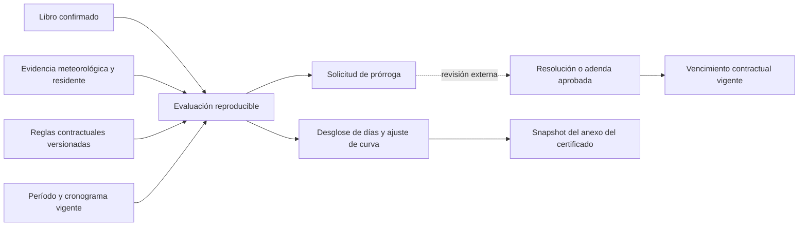

# Arquitectura de cálculo climático contractual

Estado: arquitectura con una primera implementación funcional en Preview, solicitada posteriormente por el usuario. El botón **Parámetros del PBC**, junto al calendario, registra reglas por proyecto/contrato en versiones inmutables DRAFT/VALIDATED. No requiere un PBC real para desarrollar la arquitectura; los valores deben ser revisados contra documentos al configurar cada contrato.

## Implementación disponible

- Formulario de documento/cláusula, vigencia, plazo/calendario, umbral/fuente, tipos y causas elegibles, evidencia/causalidad/conformidad, tolerancia, topes y redondeo. Los valores jurídicos no tienen defaults globales. Inicio/plazo existentes del proyecto se muestran como base editable.
- Fórmula permitida `EXCESS_ELIGIBLE_DAYS_V1`: días confirmados elegibles menos tolerancia, redondeo y topes. Tolerancia mensual, acumulada o por período; meses parciales completos o prorrateados por días corridos dentro del plazo base. No admite carry-over, jornadas parciales, fórmulas arbitrarias ni cambios de acumulador entre adendas; estos casos quedan bloqueados o como borrador para implementación específica.
- Versiones con igual vigencia: usa la versión validada más reciente. Cambios compatibles por fecha se resuelven con su vigencia. Una adenda que altera plazo/calendario/tolerancia acumulada entre vigencias se bloquea explícitamente: no inventa cómo mezclar acumuladores.
- Valoraciones de impedimento/conformidad con referencias, ligadas a la huella de la jornada: una corrección posterior invalida su uso hasta volver a valorar. No modifica evidencia ni autoridad del Libro.
- Prórrogas ya aprobadas, documentadas y separadas del resultado climático. La fecha teórica climática y el vencimiento con aprobaciones son salidas diferentes; no se suman dos veces automáticamente.
- Anexo completo asociado explícitamente a un certificado BORRADOR, con reglas/hechos/resultado y hash inmutables. El PDF usa el snapshot más reciente asociado antes de la emisión. El período del certificado queda protegido una vez que tiene anexo. No cambia importes ni la curva financiera.
- Migración `20261005232618_contract_climate_parameters`: cuatro tablas nuevas con RLS, acceso por tenant/rol/plan, INSERT/SELECT internos, sin grants a anon, sin backfill. Aplicada exclusivamente al proyecto Preview `xddlzgjwufskgasomval`; Production no se modificó. Evaluaciones independientes son de sólo lectura; su persistencia autónoma sigue siendo una ampliación futura.

La implementación V1 no reemplaza todo el diseño extendido siguiente. En particular, no presenta un ajuste porcentual de curva como si fueran días de prórroga y no afirma soportar cualquier fórmula de PBC.

## 1. Separación de responsabilidades



- `climate_events` conserva observaciones externas/locales; `climate_evidence` conserva evidencia independiente e inmutable.
- `project_workday_status` conserva la clasificación confirmada del Libro y su autoría. Confirmación administrativa no equivale a aceptación de fiscalización ni aprobación de prórroga.
- La política contractual interpreta hechos para un propósito determinado. Nunca cambia el origen del hecho ni convierte una propuesta en confirmación.
- La evaluación produce un resultado justificable y trazable, no una resolución de la contratante.
- El certificado económico conserva cantidades y precios. La curva financiera, la curva física y los días de extensión son magnitudes diferentes.

## 2. Modelo de parámetros

Cada campo admite un estado explícito: `UNSET`, `VALUE` o `NOT_APPLICABLE`. No cargar un valor no significa cero. Una política incompleta puede guardarse como borrador; no puede activarse ni emitir un cálculo contractual completo.

| Grupo | Parámetros |
| --- | --- |
| Identidad | Empresa, contrato/proyecto, versión, documento/adenda de origen, cláusulas y páginas |
| Vigencia | Inicio/fin de aplicación, propósito, borrador/validado/activo/retirado, validado por y fecha |
| Plazo base | Evento inicial, fecha, días corridos/hábiles, tratamiento del día inicial, calendario laboral/feriados y zona horaria |
| Precipitación | Umbral decimal en mm, operador `GT`/`GTE`, fuente exigida, estación/zona admisible, regla ante fuentes divergentes |
| Afectación | Clasificaciones/códigos elegibles, necesidad de impedimento efectivo y de conformidad de fiscalización |
| Consecuencias | Si admite efectos posteriores, vínculo causal requerido, evidencia y límites temporales |
| Otras causas | Catálogo de causas elegibles y documentos requeridos; O nunca admite toda causa indiscriminadamente |
| Tolerancia | Cantidad y unidad, agrupación mensual/período contractual/acumulada, tratamiento de meses parciales y saldo trasladable |
| Límites | Tope mensual/global/porcentaje del plazo, base del porcentaje y orden de aplicación |
| Incidencia | Jornada completa/parcial si está expresamente soportada, redondeo y acumulación |
| Curva | Identificador y versión de fórmula, variables, unidades, base de días y cronograma vigente |
| Procedimiento | Plazos de comunicación, solicitud, conformidad y documentos de aprobación |

La política separa `day_eligibility`, `curve_adjustment` y `extension_request`: un mismo día puede ser elegible para un informe y no para otro. Tolerancia, umbral, divisor, límite y fórmula no tendrán defaults jurídicos globales.

### Tipos de fórmula

- Registro de fórmulas permitidas con identificador y versión; implementación determinista revisada.
- Fórmula y todos sus parámetros tipados, con unidades y rangos explícitos.
- No ejecutar texto del PBC mediante `eval`, SQL dinámico o código arbitrario.
- Una fórmula no soportada devuelve `UNSUPPORTED_RULE`, conservando la cláusula para implementar y revisar el caso.
- La extracción mediante IA produce un borrador con referencias. La activación requiere validación humana.

## 3. Entidades propuestas para una segunda PR

Estos nombres son diseño, no tablas ya existentes.

| Entidad | Responsabilidad e invariantes |
| --- | --- |
| `contract_climate_policy_versions` | Parámetros tipados, schema/formula version, tenant/project, vigencia y referencias. Una versión validada es inmutable; cambios generan otra versión. |
| `contract_day_assessments` | Elegibilidad contractual por fecha/propósito, hechos/evidencia referenciados, motivo, impedimento y conformidad. No duplica ni sobrescribe el Libro. |
| `contract_climate_evaluations` | Período, corte, política(s), cronograma y monto contractual vigentes, entradas congeladas, hash, versión del motor y salida desglosada. |
| `contract_time_adjustments` | Solicitud versus reconocimiento aprobado, días/fechas reconocidos, documento, autoridad y vigencia. Identidad documental evita sumar dos veces una prórroga. |
| `certificate_climate_snapshots` | Relación certificado/evaluación y snapshot inmutable usado en el anexo. Los borradores recalculan; certificados emitidos conservan su cálculo. |

Claves foráneas y unicidad deben incluir la pertenencia al mismo tenant/proyecto. RLS y acciones mantienen las autorizaciones administrativas actuales, sin otorgar privilegios nuevos. Activación, aprobación documental y congelado serán transacciones controladas; evaluar/consultar será de sólo lectura salvo la creación explícita de una evaluación.

El plan inicial de separar todo en una segunda PR fue sustituido por la solicitud posterior de implementar el registro ahora. La V1 y su migración Preview continúan en PR #33; no se fusionó ni desplegó Production.

## 4. Algoritmo de evaluación

1. Validar período/corte, inicio contractual, calendario y política completa para el propósito solicitado.
2. Resolver las versiones de política y cronograma por vigencia. Ambigüedades o solapamientos impiden un resultado completo. Un período que atraviesa una adenda se desglosa según las reglas de vigencia; no se aplica una versión a todo el mes por defecto.
3. Seleccionar hechos confirmados dentro del período y ámbito contractual. Excluir propuestas, fechas futuras o fuera del contrato. Días sin registro se muestran como desconocidos, sin inventar B.
4. Unificar por fecha. Fotos, registros de estaciones y efectos coincidentes no multiplican el día. Conflictos no resolubles producen una incidencia explícita.
5. Evaluar evidencia y afectación con las reglas específicas. HH no se trata como efecto de lluvia sólo por su etiqueta; cuando se exige causalidad debe existir vínculo o valoración contractual explícita.
6. Marcar cada fecha como elegible/no elegible/pendiente, indicando causa, cláusula y evidencia. Los datos pendientes producen resultado provisional con incidencias, no un cero definitivo.
7. Agrupar las fechas según la política, aplicar tolerancias y límites en el orden definido. Jornada parcial se acepta sólo si el modelo y la fórmula la soportan; no redondearla silenciosamente a un día entero.
8. Calcular ajuste de curva con variables de avance y períodos reales. No restar días a porcentajes ni usar cobertura temporal del cronograma como atraso ejecutado.
9. Calcular días para solicitar prórroga separadamente. Mantener el vencimiento oficial con los ajustes aprobados documentados, usando el calendario y la convención del contrato; no sumar solicitudes pendientes.
10. Emitir estado `COMPLETE`, `PROVISIONAL` o `BLOCKED`, desglose por fecha/grupo, incidencias y referencias. Congelar entradas y resultado cuando se incorpora al certificado.

### Salida esperada

```text
period / as_of / purpose
policy_version_ids / engine_version / schedule_version / input_hash
status / issues
dates: date, workday_id, evidence_ids, final_code,
       eligibility, exclusion_reason, clause_reference, eligible_fraction
groups: group_period, eligible_days, tolerance, excess, cap, computable_days
curve: formula_id, variables_with_units, result, rounding
extension: requestable_days, approved_adjustments, current_due_date
```

La repetición del mismo snapshot/política/versión del motor genera el mismo resultado. Una nueva observación, corrección del Libro o adenda genera otra evaluación, no modifica retroactivamente el snapshot emitido.

## 5. Ajustes necesarios al software existente

| Código actual | Conservar / ajustar |
| --- | --- |
| Calendario y acciones canónicas | Conservar clasificación, procedencia MANUAL en decisiones administrativas, origen de propuestas en confirmación simple y evidencia independiente. |
| `deriveClimateForecastMetrics` | Conservar como estimación operativa; `calendarDays - scheduledDates.size` no mide atraso real. No usar `weather_adjusted_variance` como extensión o penalización contractual. |
| HH del calendario | Actualmente `NON_WORKABLE_OTHER` + `TERRAIN_SATURATED`. Interpretación contractual separada; no cambiar ese dominio sólo para sumar HH al clima. |
| Curva en `buildMultiSeries` | Agrupar por `period_start`/`period_end` reales y corte; contemplar varios certificados en un mes y meses vacíos. Diferenciar presentado/verificado/aprobado según finalidad del informe. |
| Avance por importe | Identificar como financiero; avance físico exige cantidades/pesos apropiados. Mantener denominador y versión de monto contractual consistentes. |
| Anexo climático | Incorporar sólo el snapshot del período y sus incidencias. No mezclar datos LEGACY con días contractuales vigentes. |
| Fechas y cronogramas | Usar orden de inicio y convenciones contractuales explícitas. Días corridos, días hábiles y semanas de planificación no son intercambiables. |

## 6. Ejemplos sintéticos para validar la arquitectura

No representan reglas de Paraguay ni de un PBC real. Son contratos ficticios de prueba.

| Caso | Configuración / entrada | Resultado esperado |
| --- | --- | --- |
| Umbral estricto | Umbral 10, `GT`, observación 10 mm | No supera umbral. |
| Umbral inclusivo | Umbral 10, `GTE`, observación 10 mm | Supera umbral; aún debe cumplir evidencia y afectación. |
| Tolerancia mensual | 10 LL + 3 efectos admisibles, 13 fechas distintas, tolerancia 8 | 5 días excedentes antes de límites; no aprobación automática. |
| No duplicar | 10 fechas LL, una con varias fotos y estaciones | 10 fechas, no número de evidencias. |
| Coincidencia | Lluvia y consecuencia en la misma fecha | Máximo de jornada admisible según regla, nunca suma doble. |
| Causalidad | HH sin vínculo exigido | Pendiente/no elegible según política; no incluir silenciosamente. |
| O | Causa no incluida en el catálogo | No elegible para esa finalidad. |
| Mes parcial | 3 días afectados en mes parcial y tolerancia sin convención definida | Bloqueado; no prorratear automáticamente. |
| Fuentes distintas | DINAC requerido, sólo foto de residente | Evidencia insuficiente para esa regla; la foto sigue visible y preservada. |
| Propuesta | LL `PROPOSED` con 30 mm y foto | No es día confirmado computable. |
| Vacío | Día sin registro | Desconocido, no B certificado. |
| Adenda | Cambio de regla a mitad del período | Resolver vigencias y desglosar; preservar evaluaciones previas. |
| Certificados | Dos certificados en agosto, ninguno en septiembre | Ubicar por períodos reales, no por número M1/M2. |
| Atraso real | 30 días cronogramados, avance ejecutado cero | No declarar ausencia de atraso porque el cronograma cubre todas las fechas. |
| Prórroga | 5 días calculados, 2 aprobados documentalmente | Solicitud 5; vencimiento oficial incorpora únicamente lo reconocido según el documento. |
| Fórmula ausente | Política sin fórmula requerida | Resultado contractual bloqueado, no inventar divisor o fórmula. |
| Fracción | Jornada parcial sin soporte de fórmula/modelo | Incidencia explícita; no convertir en jornada completa. |
| Reproducción | Mismo snapshot, versión y parámetros | Mismo resultado y hash de entradas. |

## 7. Secuencia de implementación y revisión

1. PR #33: selección individual/múltiple y resultados por fecha, conservando interfaz y persistencia. Sin migración ni motor contractual.
2. Segunda PR: tipos/esquemas, validación, registro de fórmulas, evaluador puro y fixtures sintéticos anteriores.
3. Modelo persistente: preparar migraciones/RLS y transacciones para política, evaluaciones, aprobaciones y snapshots; revisar antes de aplicar a Preview.
4. Formularios: borrador/validación/versionado; estados incompletos visibles; referenciar la cláusula en cada parámetro.
5. Integrar períodos, curva y anexos; preservar certificados históricos y cálculo económico existente.
6. Validar con identidades de prueba autorizadas y transacciones rollback en Preview. Production sigue de sólo lectura; merge/deploy/aplicación DB requieren autorización de esa entrega.

La arquitectura se puede revisar y probar con fixtures sin esperar un documento. La primera configuración real requiere verificar el contrato y sus adendas, pero no bloquea el diseño del software.
